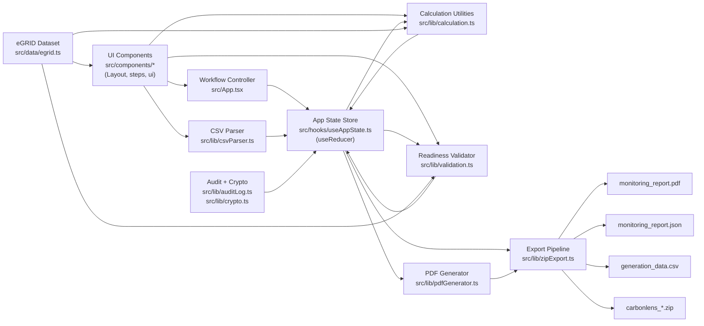

# CarbonLens Architecture

## Overview
CarbonLens is a client-side single-page app built with Vite + React + TypeScript. It implements a deterministic 5-step MRV flow for solar carbon documentation:
1. Facility onboarding
2. Generation CSV upload
3. CO2 displacement calculation
4. Readiness validation
5. Report generation/export

There is currently no backend or database. All state is held in-memory in React (`useReducer`) and is lost on page refresh.

## Project Architecture
The app uses a layered structure:
- UI layer: React components in `src/components/`
- State orchestration layer: `src/App.tsx` + `src/hooks/useAppState.ts`
- Domain logic layer: pure utilities in `src/lib/`
- Data/constants layer: eGRID dataset in `src/data/egrid.ts`
- Domain model layer: shared interfaces in `src/types/index.ts`

`src/App.tsx` is the workflow controller: it renders one step at a time, wires callbacks from step components, and appends audit events.

## System Diagram

### Diagram Data Flow
User actions in step components flow through `App.tsx` into `useAppState` actions. Steps call pure utilities (`csvParser`, `calculation`, `validation`) and commit typed results back to state. The eGRID dataset feeds factor selection, calculation, and alignment checks. In Step 5, the current state snapshot is used to generate the PDF, JSON, CSV, and audit files; `zipExport` hashes artifacts, builds a manifest, and produces the downloadable ZIP package.

## Major Folder Roles
- `src/components/Layout/`: shell components (`Header`, `StepNav`)
- `src/components/steps/`: one component per workflow step
- `src/components/ui/`: reusable primitives (`Button`, `Card`, etc.)
- `src/hooks/`: global app-state hook (`useAppState`)
- `src/lib/`: core logic
  - `calculation.ts`: displacement + revenue projection math
  - `csvParser.ts`: CSV parsing and validation
  - `validation.ts`: readiness checks across 5 categories
  - `pdfGenerator.ts`: PDF report rendering
  - `zipExport.ts`: export package + manifest assembly
  - `auditLog.ts`, `crypto.ts`: event and hashing utilities
- `src/data/`: versioned emission factors (EPA eGRID)
- `src/types/`: canonical data contracts (`Facility`, `GenerationData`, `Calculation`, etc.)
- `assets/`: static media

## Main Data Flow
1. `main.tsx` mounts `App`.
2. `App` initializes `useAppState` (single state store + actions).
3. Each step component collects input, calls pure functions in `src/lib/`, then emits typed results and audit events back to `App`.
4. `App` stores artifacts in state (`facility`, `generationData`, `calculation`, `readiness`, `reportArtifact`) and appends events to `auditLog`.
5. `StepNav` unlocks steps based on derived state.
6. Step 5 generates output files (PDF/JSON/CSV/audit/manifest) and downloads a ZIP.

State reset rules are enforced when upstream inputs change (for example, re-uploading generation data clears downstream calculation/validation/report state).

## Carbon Calculation Logic
Primary logic lives in `src/lib/calculation.ts`.
- Formula: `CO2 MT = (totalMwh * co2LbsPerMwh) / 2204.62`
- Constants are versioned in code (`FORMULA_VERSION`, `LBS_PER_MT`, `ADJUSTMENT_FACTOR`)
- Output is a typed `Calculation` record with denormalized factor metadata and source file hash

Validation of calculation integrity happens separately in `src/lib/validation.ts`, which independently re-checks arithmetic and formula version.

## 5-Step Workflow Mechanics
1. `FacilityOnboarding`: captures facility metadata, resolves eGRID factor, logs `facility_created`.
2. `GenerationUpload`: parses/validates CSV, hashes raw content (SHA-256), commits generation dataset, logs `generation_data_uploaded`.
3. `DisplacementCalculation`: computes displacement and revenue projections, logs `calculation_executed`.
4. `ReadinessValidation`: runs deterministic checks (data, generation sanity, factor alignment, calculation integrity, audit integrity), logs `readiness_validation_run`.
5. `ReportExport`: builds report package (`buildExportPackage`) and ZIP download (`downloadExportZip`), logs `report_generated` and `report_exported`.

## Future Feature Placement (Credit Listing / Transactions)
For marketplace features, keep the same separation:
- Domain models: add `CreditLot`, `Listing`, `Offer`, `Transaction` in `src/types/`.
- Domain logic: add pricing/listing/settlement utilities in new `src/lib/marketplace/` modules.
- UI flow: add new `src/components/steps/` screens after export or as a second workflow track.
- State orchestration: extend `useAppState` with marketplace slices and actions.

If persistence/API integration is introduced, add a data-access layer (for example `src/services/`) so API calls remain separate from UI and pure calculation logic.
