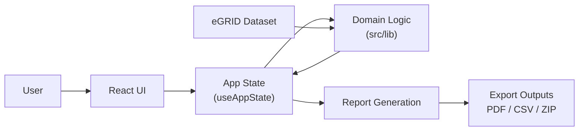

# CarbonLens

CarbonLens is a web application for small renewable energy producers to generate auditable carbon credit documentation quickly, and evolve toward transparent credit transactions.

## Problem the project solves
Small carbon credit producers often face a complex, expensive verification process with fragmented spreadsheets, limited auditability, and unclear monetization pathways. This slows credit issuance and makes market participation difficult.

## Solution overview
CarbonLense provides a deterministic 5-step workflow that transforms facility and generation inputs into a verification-ready export package (PDF/JSON/CSV/audit trail + checksums). The long-term direction extends this into a marketplace flow for credit listing, buyer discovery, and simplified transactions.



*Flow summary: the user interacts with the React screens, state is managed in `useAppState`, core calculations/validation run in `src/lib` using eGRID data, and the final step generates downloadable PDF/CSV/ZIP outputs.*

## Key features
- 5-step guided workflow: facility onboarding -> generation upload -> displacement calculation -> readiness validation -> export
- Deterministic carbon displacement calculation using versioned eGRID factors
- CSV validation and SHA-256 file hashing for tamper-evident inputs
- Readiness validation across data quality, methodology alignment, and audit integrity
- Export package generation with manifest checksums and ZIP download
- Revenue projection snapshots for common carbon price points

## Tech stack
- React 18 + TypeScript
- Vite 5
- Tailwind CSS 3 + PostCSS + Autoprefixer
- Papa Parse (CSV)
- jsPDF (report generation)
- JSZip (export packaging)
- Lucide React (icons)

## Project structure
```text
src/
  components/
    Layout/      # Header and step navigation
    steps/       # 5 workflow step screens
    ui/          # Reusable UI primitives
  hooks/         # App state management (useAppState)
  lib/           # Core domain logic (calc, validation, export, audit, crypto)
  data/          # Versioned eGRID dataset
  types/         # Shared TypeScript interfaces
assets/          # Static media assets
```

## Installation
```bash
npm install
```

## Development commands
```bash
npm run dev      # start local dev server
npm run build    # type-check + production build
npm run preview  # preview production build locally
```

## Future roadmap
- Credit inventory and listing management
- Transparent pricing dashboards
- Buyer discovery and matching
- Simplified offer/transaction workflows
- External registry or marketplace integrations

## Contributors
- Luba Kaper
- Victor Castillo
- Edwin Perez
